  <a href="#contributions">Contributions</a> &bull; <a href="#profile">Profile</a> &bull; <a href="#skills">Skills</a> &bull; <a href="#focus">Focus</a> &bull; <a href="#connect">Connect</a>

<h1 align="center"><code style="color:#f0f6fc">ikky</code><code style="color:#39d353">@</code><code style="color:#f0f6fc">codes</code></h1>

<code style="color:#8b949e">AI/ML Engineer</code> <code style="color:#30363d">&bull;</code> <code style="color:#8b949e">B.Tech Computer Science</code>

 

<!-- ============================================================
     CONTRIBUTIONS
     ============================================================ -->

## Contributions

  

<code style="color:#8b949e">real contribution data &middot; fetched from github.com/users/ikkycodes/contributions</code>

 

<!-- ============================================================
     PROFILE
     ============================================================ -->

## Profile

  

 
<!-- ============================================================
     SKILLS
     ============================================================ -->

## Skills

 

  

    &#9656; PROGRAMMING
  

  

    PYTHON
    SQL
  

  

    &#9656; MACHINE LEARNING
  

  

    SCIKIT-LEARN
    SUPERVISED LEARNING
    UNSUPERVISED LEARNING
    CLASSICAL MACHINE LEARNING
  

  

    &#9656; DATA
  

  

    NUMPY
    PANDAS
    MATPLOTLIB
  

  

    &#9656; DEEP LEARNING / AI
  

  

    TENSORFLOW
    KERAS
    COMPUTER VISION
    GENERATIVE AI
    LLMs
  

 

  

    &#9656; GENERATIVE AI
  

  

    RAG
    EMBEDDINGS
    VECTOR DATABASES
    LANGCHAIN
  

  

    &#9656; BACKEND / DEPLOYMENT
  

  

    FASTAPI
    STREAMLIT
    DOCKER
    GIT
    GITHUB
  

 

<!-- ============================================================
     CURRENT FOCUS
     ============================================================ -->

## Current Focus

  

    &#9656; CURRENTLY EXPLORING
  

  

    &#8594;&nbsp;Advanced Machine Learning 
    &#8594;&nbsp;Deep Learning 
    &#8594;&nbsp;Generative AI 
    &#8594;&nbsp;RAG Systems 
    &#8594;&nbsp;MLOps 
    &#8594;&nbsp;Building real-world AI applications 
  

 
<!-- ============================================================
     CONNECT
     ============================================================ -->

## Connect

  

    [GitHub]&nbsp;<a href="https://github.com/ikkycodes" style="color:#f0f6fc;text-decoration:none;">github.com/ikkycodes</a> 
    [LinkedIn]&nbsp;<a href="https://www.linkedin.com/in/ikjyot-singh06" style="color:#f0f6fc;text-decoration:none;">linkedin.com/in/ikjyot-singh06</a> 
    [Email]&nbsp;<a href="mailto:realikky66@gmail.com" style="color:#f0f6fc;text-decoration:none;">realikky66@gmail.com</a> 
    [Kaggle]&nbsp;<a href="https://www.kaggle.com/notikkyatall" style="color:#f0f6fc;text-decoration:none;">kaggle.com/notikkyatall</a>
  

 

<code style="color:#30363d">generated with SVG-native animation &middot; no JavaScript &middot; updated weekly via GitHub Actions</code>
