  <a href="#boot">Boot</a> &bull; <a href="#pipeline">Pipeline</a> &bull; <a href="#contributions">Contributions</a> &bull; <a href="#profile">Profile</a> &bull; <a href="#skills">Skills</a> &bull; <a href="#projects">Projects</a> &bull; <a href="#current-focus">Focus</a> &bull; <a href="#connect">Connect</a>

<h1 align="center"><code style="color:#f0f6fc">ikky</code><code style="color:#39d353">@</code><code style="color:#f0f6fc">codes</code></h1>

<code style="color:#8b949e">AI/ML ENGINEER · B.TECH COMPUTER SCIENCE · FUTURISTIC TERMINAL PROFILE</code>

 

<!-- ============================================================
     BOOT
     ============================================================ -->

## Boot

<code style="color:#39d353">ikky@github</code> <code style="color:#f0f6fc">~</code> <code style="color:#8b949e">$ ./initialize_ai.sh</code>

  

 

<!-- ============================================================
     PIPELINE
     ============================================================ -->

## Pipeline

<code style="color:#39d353">ikky@github</code> <code style="color:#f0f6fc">~</code> <code style="color:#8b949e">$ ./ml-pipeline.sh</code>

  

 

<!-- ============================================================
     CONTRIBUTIONS
     ============================================================ -->

## Contributions

<code style="color:#39d353">ikky@github</code> <code style="color:#f0f6fc">~</code> <code style="color:#8b949e">$ ./contributions.sh</code>

  

<code style="color:#8b949e">real contribution data · fetched from github.com/users/ikkycodes/contributions · refreshed weekly by GitHub Actions</code>

 

<!-- ============================================================
     WHO AM I
     ============================================================ -->

## Profile

<code style="color:#39d353">ikky@github</code> <code style="color:#f0f6fc">~</code> <code style="color:#8b949e">$ whoami</code>

  

 
<!-- ============================================================
     SKILLS
     ============================================================ -->

## Skills

<code style="color:#39d353">ikky@github</code> <code style="color:#f0f6fc">~</code> <code style="color:#8b949e">$ cat skills.txt</code>

 

  
<code style="color:#58d6ff">▸ PROGRAMMING</code>

  

    PYTHON
    SQL
  

  
<code style="color:#58d6ff">▸ MACHINE LEARNING</code>

  

    SCIKIT-LEARN
  

  

    SUPERVISED LEARNING
    UNSUPERVISED LEARNING
  

  

    CLASSICAL MACHINE LEARNING
  

  
<code style="color:#58d6ff">▸ DATA</code>

  

    NUMPY
    PANDAS
    MATPLOTLIB
  

  
<code style="color:#58d6ff">▸ DEEP LEARNING / AI</code>

  

    TENSORFLOW
    KERAS
  

  

    COMPUTER VISION
    GENERATIVE AI
    LLMs
  

  
<code style="color:#58d6ff">▸ GENERATIVE AI</code>

  

    RAG
    EMBEDDINGS
  

  

    VECTOR DATABASES
    LANGCHAIN
  

  
<code style="color:#58d6ff">▸ BACKEND / DEPLOYMENT</code>

  

    FASTAPI
    STREAMLIT
    DOCKER
  

  

    GIT
    GITHUB
  

 
<!-- ============================================================
     PROJECTS
     ============================================================ -->

## Projects

<code style="color:#39d353">ikky@github</code> <code style="color:#f0f6fc">~</code> <code style="color:#8b949e">$ ls ./projects</code>

  

    <code style="color:#39d353">01</code>&nbsp;<code style="color:#f0f6fc">Credit Card Fraud Detection</code> 
    <code style="color:#39d353">02</code>&nbsp;<code style="color:#f0f6fc">Movie Recommendation System</code> 
    <code style="color:#39d353">03</code>&nbsp;<code style="color:#f0f6fc">Resume Screening System</code> 
    <code style="color:#39d353">04</code>&nbsp;<code style="color:#f0f6fc">CSIC Website</code> 
    <code style="color:#39d353">05</code>&nbsp;<code style="color:#8b949e">[Future Project]</code>
  

<code style="color:#8b949e">↳ edit this block to add project links &amp; descriptions</code>

 

<!-- ============================================================
     CURRENT FOCUS
     ============================================================ -->

## Current Focus

<code style="color:#39d353">ikky@github</code> <code style="color:#f0f6fc">~</code> <code style="color:#8b949e">$ ./current-focus.sh</code>

  
<code style="color:#58d6ff">CURRENTLY EXPLORING</code>

  

    <code style="color:#39d353">→</code> <code style="color:#f0f6fc">Advanced Machine Learning</code> 
    <code style="color:#39d353">→</code> <code style="color:#f0f6fc">Deep Learning</code> 
    <code style="color:#39d353">→</code> <code style="color:#f0f6fc">Generative AI</code> 
    <code style="color:#39d353">→</code> <code style="color:#f0f6fc">RAG Systems</code> 
    <code style="color:#39d353">→</code> <code style="color:#f0f6fc">MLOps</code> 
    <code style="color:#39d353">→</code> <code style="color:#f0f6fc">Building real-world AI applications</code>
  

 

<!-- ============================================================
     CONNECT
     ============================================================ -->

## Connect

<code style="color:#39d353">ikky@github</code> <code style="color:#f0f6fc">~</code> <code style="color:#8b949e">$ connect</code>

| Platform | Link |
| :--- | :--- |
| **GitHub** | <a href="https://github.com/ikkycodes">github.com/ikkycodes</a> |
| LinkedIn | [ADD LINK] |
| Email | [ADD EMAIL] |
| Portfolio | [ADD LINK] |
| Kaggle | [ADD LINK] |

<code style="color:#8b949e">[ADD LINK] / [ADD EMAIL] → replace the placeholders in this README</code>

 

  <code style="color:#39d353">ikky@github</code> <code style="color:#f0f6fc">~</code> <code style="color:#8b949e">$</code>&nbsp;<code style="color:#39d353">█</code>

<code style="color:#30363d">generated with SVG-native animation · no JavaScript · no external services</code>
