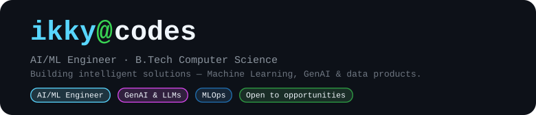

  <a href="#about"><b>About</b></a> &bull; <a href="#projects"><b>Projects</b></a> &bull;
  <a href="#skills"><b>Skills</b></a> &bull; <a href="#activity"><b>Activity</b></a> &bull; <a href="#connect"><b>Connect</b></a>

  

 

<!-- ============================================================
     ABOUT
     ============================================================ -->

## About

  <b>AI/ML Engineer</b> &middot; <b>B.Tech Computer Science</b> 
  <i>I design and ship intelligent systems — ML pipelines, GenAI &amp; RAG apps, and data products end-to-end.</i>

- 🔭 Currently building: **GenAI &amp; RAG applications**
- 🌱 Learning: **MLOps, LLM engineering &amp; clean architecture**
- 📫 Looking for: **AI/ML engineering roles, internships &amp; collabs**

<!-- ============================================================
     SKILLS
     ============================================================ -->

## Skills

 

  
<b>&#9656; PROGRAMMING</b>

   

 

  
<b>&#9656; MACHINE LEARNING</b>

     

 

  
<b>&#9656; DATA</b>

    

 

  
<b>&#9656; DEEP LEARNING / AI</b>

      

 

  
<b>&#9656; GENERATIVE AI</b>

     

 

  
<b>&#9656; BACKEND / DEPLOYMENT</b>

      

 

<!-- ============================================================
     PROJECTS
     ============================================================ -->

## Projects

 

| | Project | What it does | Built with |
|---|---|---|---|
|  | [ChurnGaurd](https://github.com/ikkycodes/ChurnGaurd) | AI-powered customer churn prediction app | `Python · ML · Streamlit` |
|  | [DataGenie](https://github.com/ikkycodes/DataGenie-Natural-Language-Data-Analyst) | Natural Language Data Analyst — chat with your dataset | `Python · GenAI · LLMs` |
|  | [Flight Price Prediction](https://github.com/ikkycodes/Flight-Price-Prediction) | Price forecasting with Random Forest + full EDA | `Python · Scikit-learn · Jupyter` |
|  | [Movie Recommender](https://github.com/ikkycodes/Movie-Recommender-system) | Content-based top-5 movie recommendations | `NLP · Scikit-learn · Streamlit` |
|  | [Resume Screening](https://github.com/ikkycodes/Resume-Screening-App) | Resume parsing, skill extraction & candidate matching | `Python · NLP · Streamlit` |
|  | [TrendPulse](https://github.com/ikkycodes/TrendPulse-ikky) | Trend pipeline: collect → process → analyze → visualize | `Python · Pandas · Matplotlib` |

 

<!-- ============================================================
     ACTIVITY
     ============================================================ -->

## Activity

  

real contribution data &middot; auto-refreshed every Sunday

 

<!-- ============================================================
     CONNECT
     ============================================================ -->

## Connect

 

&nbsp;&nbsp;&nbsp;

  <b>GitHub</b> &middot; <b>LinkedIn</b> (in/ikjyot-singh06) &middot; <b>realikky66@gmail.com</b> &middot; <b>Kaggle</b> (@notikkyatall)

 

<code>ikky@codes</code> &middot; profile artwork regenerated weekly by GitHub Actions

